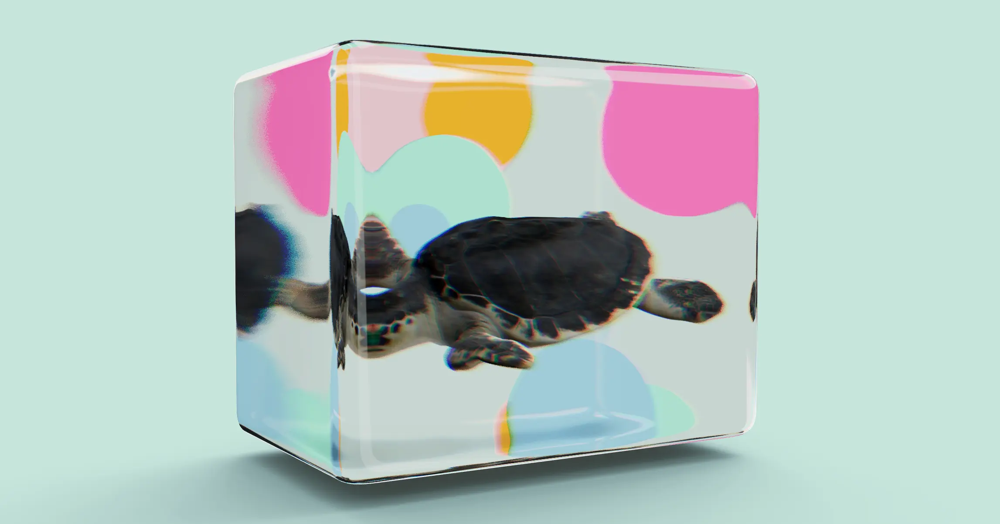

[](https://pmndrs.github.io/examples/aquarium)
[](https://codesandbox.io/s/github/pmndrs/examples/tree/main/examples/aquarium)
[](https://stackblitz.com/github/pmndrs/examples/tree/main/examples/aquarium)

```sh
$ npx degit pmndrs/examples/examples/aquarium
```



## The problem

Glass that _contains_ something is not the same problem as glass. Transparency alone gets you a pane: whatever is behind it is still drawn on its own terms, so contents that reach past the edges of the box stay visible past them, and the result reads as a sheet in front of a scene rather than as a vessel. The spheres here are placed well outside the box, some of them more than twice its half-width away — the containment is not geometric, and no amount of tuning the glass will produce it.

## The technique

The contents are drawn nowhere on the canvas, and only inside the glass.

`useMask` returns a set of material properties that test the stencil buffer against a reference value, and `Aquarium` assigns them, once on mount, to every material it finds under the group holding its children. Nothing in this demo ever writes that reference into the canvas stencil buffer. The test therefore fails everywhere, and the turtle and the spheres are never drawn to the screen at all.

`MeshTransmissionMaterial` is what draws them. It does not sample `three`'s shared transmission pass: it renders the whole scene itself, into its own render targets, with the glass mesh swapped out for a discarding material, and its refraction shader samples the result. Those render targets carry no stencil buffer — and a stencil test against a buffer that does not exist passes. The same materials that are rejected on the canvas are accepted there.

So the contents exist only inside the refraction. The box is not showing what sits behind it; it is the only surface on which its contents appear anywhere, which is why spheres positioned outside it read as suspended in it — clipped exactly to its silhouette, carrying the `distortion` and `chromaticAberration` of the material that drew them.

`backside` adds a pass over the box's back faces before the main one, so the far wall is refracted through the near one. That is what makes it read as a volume of glass rather than a single sheet.

## The pitfalls

**`gl={{ stencil: true }}` on the `Canvas` is load-bearing, and it is not the default.** A context is created without a stencil buffer unless one is asked for, and that puts the canvas in the same position as the render targets: the test passes, and every sphere is drawn on screen, floating outside the box. The prop is easy to drop in a rewrite because nothing else in the file mentions it.

**The masking happens once, by traversal.** Anything mounted into the contents after that, or any material replaced later, is not masked and appears on the canvas.

**Invisible is not absent.** The contents are still in the scene graph, so they are still raycast — a pointer handler on something inside the box fires from a region of the canvas where nothing was drawn.

**The frame is three renders of the scene, not one:** the backside pass, the main transmission pass, and the canvas. `samples` and the buffer resolution are the two knobs that matter if it costs too much.
