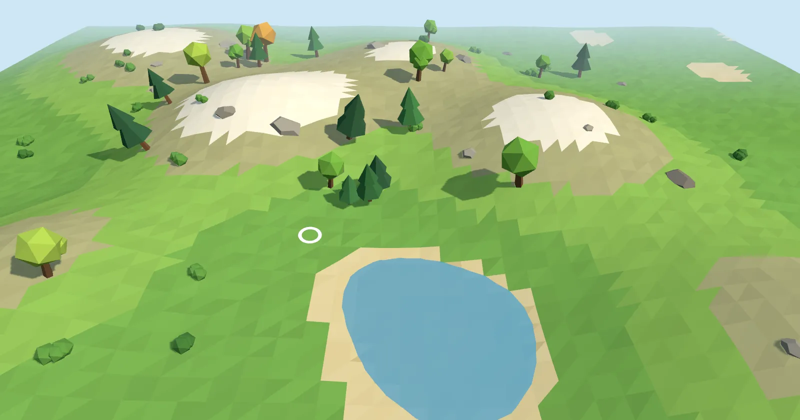

[](https://pmndrs.github.io/examples/depth-picking)
[](https://codesandbox.io/s/github/pmndrs/examples/tree/main/examples/depth-picking)
[](https://stackblitz.com/github/pmndrs/examples/tree/main/examples/depth-picking)

```sh
$ npx degit pmndrs/examples/examples/depth-picking
```


