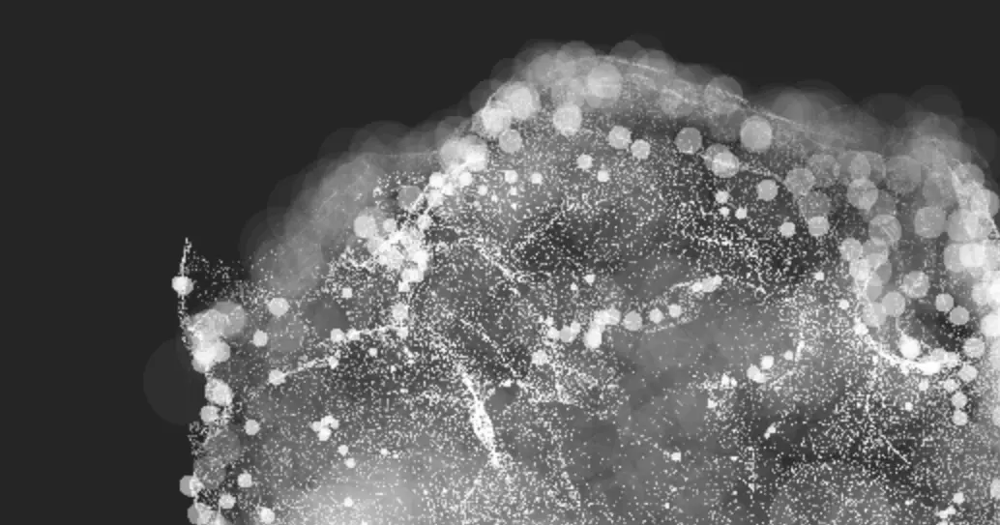

[](https://pmndrs.github.io/examples/gpgpu-curl-noise-dof)
[](https://codesandbox.io/s/github/pmndrs/examples/tree/main/examples/gpgpu-curl-noise-dof)
[](https://stackblitz.com/github/pmndrs/examples/tree/main/examples/gpgpu-curl-noise-dof)

```sh
$ npx degit pmndrs/examples/examples/gpgpu-curl-noise-dof
```



## The problem

Animating a quarter of a million particles means producing a quarter of a million positions per frame. Computing them on the CPU and uploading the result puts the whole effect behind the bus rather than behind the arithmetic, and the arithmetic is the part a GPU is good at. What is missing is somewhere for the GPU to put an array.

## The technique

A texture is that array, and a fragment shader is the loop that fills it.

A quad covering clip space is `createPortal`ed into a scene of its own, detached from the one on screen, and rendered once per frame into the float target `useFBO` allocates. Rasterising that quad runs the fragment shader exactly once per texel, and each invocation writes one particle's position where a colour would normally go. `extend` is what lets both of those shader materials be written as JSX.

The point cloud that draws the result carries no positions in its `position` attribute at all — one texel address per particle, and nothing more. Its vertex shader fetches the real position from the texture. The geometry never changes; the texture does.

What the shader computes deserves naming precisely, because the name of the folder suggests otherwise: **there is no ping-pong here.** There is one target, no feedback, and the sphere of seed points is re-read every frame and never overwritten. Position is a closed-form function of seed and time, so the demo is a position _field_, not a particle simulation — nothing accumulates and nothing is remembered between frames. That is what buys the simplicity, and it is what has to be given up first.

The depth of field is not a post pass either. `gl_PointSize` grows with a particle's distance from the focal plane while its opacity falls, so the circle of confusion is literally the sprite; the fragment stage then discards everything outside a unit disc to round the square off. Blurred and sharp particles cost exactly the same.

## The pitfalls

**`fov` is not a field of view.** It gates visibility — a particle draws only if its column fraction clears a threshold derived from it — so raising it thins the cloud. It saves rasterisation only; every particle is still simulated.

**The curl noise is not divergence-free.** The curl is normalised to unit length before use, which is a non-linear rescale and destroys exactly the incompressibility that curl noise is cited for. It is a look, arrived at by ear, and transplanting it in the expectation of fluid-like flow will not produce fluid-like flow.

**The cloud is a surface, not a volume.** Every seed sits at one radius, so the seed set is a two-dimensional shell and everything downstream is a warped sheet. Vary the radius to fill it.

**Blur is resolution-dependent.** Sprite size is in framebuffer pixels and is never scaled by device pixel ratio, so the effect is half as strong on a 2× display; drivers also clamp point size, so extreme settings quietly stop growing.

**Wanting state means restructuring.** Collisions, ageing, emission, a mouse that pushes — each needs the previous frame, which means a second target and a swap, and that change reaches everything downstream of it.
