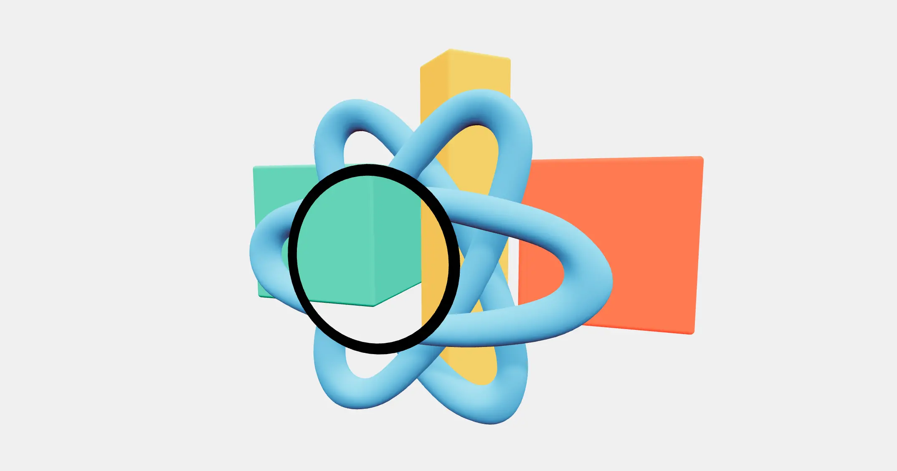

[](https://pmndrs.github.io/examples/inverted-stencil-buffer)
[](https://codesandbox.io/s/github/pmndrs/examples/tree/main/examples/inverted-stencil-buffer)
[](https://stackblitz.com/github/pmndrs/examples/tree/main/examples/inverted-stencil-buffer)

```sh
$ npx degit pmndrs/examples/examples/inverted-stencil-buffer
```



## The problem

You want an object to appear only inside a shape you can move around the screen — a window — or everywhere except inside it — a hole. The routes that suggest themselves cost a second render of the scene: a portal, a render texture, a camera with clipping planes. And because the two results look like opposites, it is natural to expect two different arrangements to produce them.

## The technique

They are one arrangement, differing by a single comparison.

`Mask` draws an ordinary mesh with its colour and depth writes turned off. It contributes no pixels and occludes nothing; all it leaves behind is an integer stamped into the stencil buffer over every pixel its silhouette covers. That buffer holds no picture — one small label per pixel, and nothing else.

`useMask` supplies the other half: material properties that switch the stencil test on and keep a fragment only where the buffer holds that same integer. Its second argument flips the comparison from equal to not-equal, and that flip is the whole inversion — the same stamp, read the other way round. Nothing about the mask changes, which is why `invert` belongs to the material being masked and not to the mask: two materials sharing one id may disagree, one revealing where the other hides.

Both `CircularMask`s here carry the same id, so their silhouettes union into a single region and one object is windowed by two masks at once. Putting them under `PivotControls` makes the point the technique rests on visible: drag one and the cut follows it across the screen, because a mask is a screen-space label rather than a shape in the scene. Its own position and depth matter only insofar as they change which pixels it covers.

The `Frame` ring takes no part in any of this. It is an ordinary mesh parked where the invisible mask sits — which is how a stencil mask gets a visible rim.

## The pitfalls

**`gl={{ stencil: true }}` on the `Canvas` is load-bearing, and it is not the default.** three stopped asking for a stencil attachment in r163. Without it there is no buffer to stamp, and every mask silently does nothing — no warning, no error, an unmasked scene.

**Anything that renders the scene into a render target drops the mask.** Render targets are created without a stencil buffer unless asked, so postprocessing, render textures and cube cameras all lose it.

**Ids do not compose.** The stamp is unconditional and it overwrites. Two masks with different ids that overlap on screen do not layer — the region belongs to whichever drew last. Sharing one id gives a union, and that union is the only combination available; anything finer needs stencil parameters drei does not expose.

**The mask reaches materials, not objects.** There is no inherited or group-level mask: masking a loaded model means walking it and assigning the properties to every material it contains.

**Invisible is not absent.** The shadow pass copies no stencil state, so an object with a hole punched in it still casts a whole shadow. Raycasting and pointer events are equally blind to the cut.
