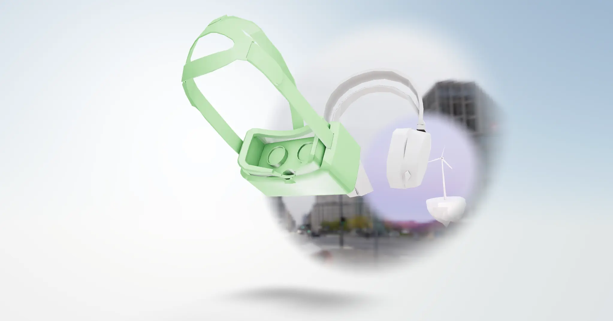

[](https://pmndrs.github.io/examples/portals)
[](https://codesandbox.io/s/github/pmndrs/examples/tree/main/examples/portals)
[](https://stackblitz.com/github/pmndrs/examples/tree/main/examples/portals)

```sh
$ npx degit pmndrs/examples/examples/portals
```



## The problem

A second world seen through a hole in the air is not a screen showing a video of that world. A screen skews: render a scene to a texture, map it onto a surface by its texture coordinates, and the image slides with the surface as the camera moves, because it is painted _on_ the surface. A hole does the opposite — what you see through it shifts against the frame exactly as a real opening would. Faking that shift is a parallax correction, and it is the part that never quite convinces.

## The technique

Nothing is faked, because the image was never mapped onto the frame.

`MeshPortalMaterial` turns its children into a separate scene and renders them with the _outer_ camera, into a buffer the size of the whole canvas rather than the size of the mesh. The frame's shader then looks that buffer up by the fragment's position **on screen**. The mesh contributes a silhouette and a depth, never a colour: it is a per-pixel decision about which of two full-canvas renders wins. Parallax is correct because the second world was drawn from the same viewpoint as the first, and was never projected onto anything.

Once that is the mechanism, the rest of the demo is what the mechanism makes cheap. A portal's children are an ordinary scene, so they can contain lights, a model, an `Environment` of their own — and another portal. Nesting costs one more full-canvas render per level and nothing conceptually.

`worldUnits` decides which space the contents are expressed in. Left off, they are relative to the frame and travel with it; switched on, they are absolute and the frame slides across them like a window over a landscape. `PivotControls` is what makes that legible: the toggle is invisible until the frame moves.

`blur` softens the silhouette by fading alpha near it, read from a distance field flood-filled once at mount. It is a fraction of the frame's inner radius rather than a width, so it survives scaling the frame.

## The pitfalls

**`resolution` does not size the portal.** It sizes the distance-field buffer alone. The scene render is always the canvas times the device pixel ratio, and the uniform of that name is overwritten with the canvas dimensions regardless of what is passed. There is no way to render a portal small — which is the whole cost story below.

**Every visible portal is another full-canvas render of a whole scene, every frame,** however small the frame looks on screen. The two nested here mean three. Frustum culling switches an unseen one off, and it cascades: culling an outer frame silences everything nested inside it.

**A sky is geometry, not a setting.** `Sky` sits in the outer scene, and a portal's contents are a different scene, so the outer sky is invisible through the frame. Each world needs its own.

**`blur` needs `transparent`,** or the alpha ramp is discarded and the rim stays hard. And the fade is only correct on flat, front-facing frames: the field is baked from a flat projection but read through the mesh's own coordinates, whatever the documentation says about arbitrary geometry.

**Nothing can lean out of the frame.** The frame is a flat mask writing its own depth; the inner world cannot cross it. Something reaching through is a different technique — a duplicate outside, sliced with clipping planes.
